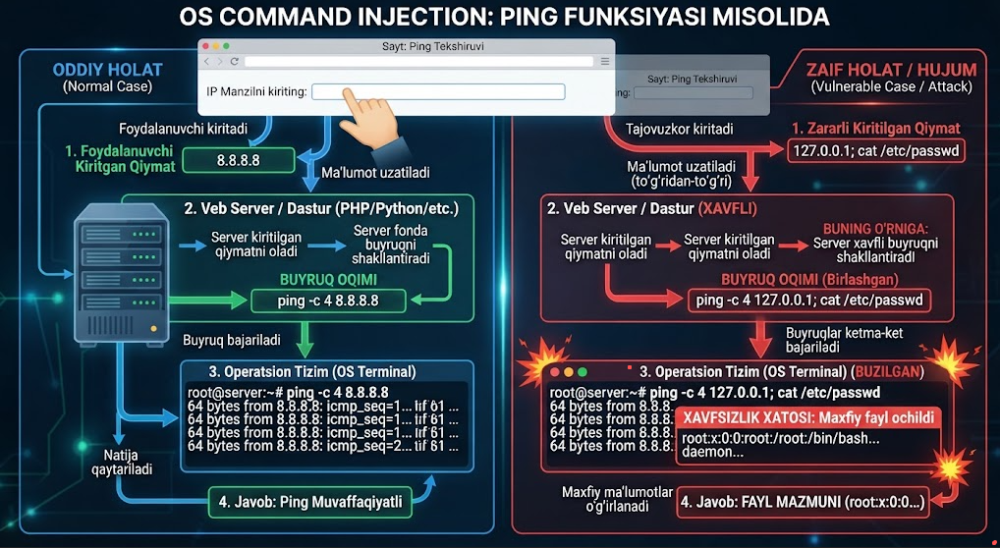
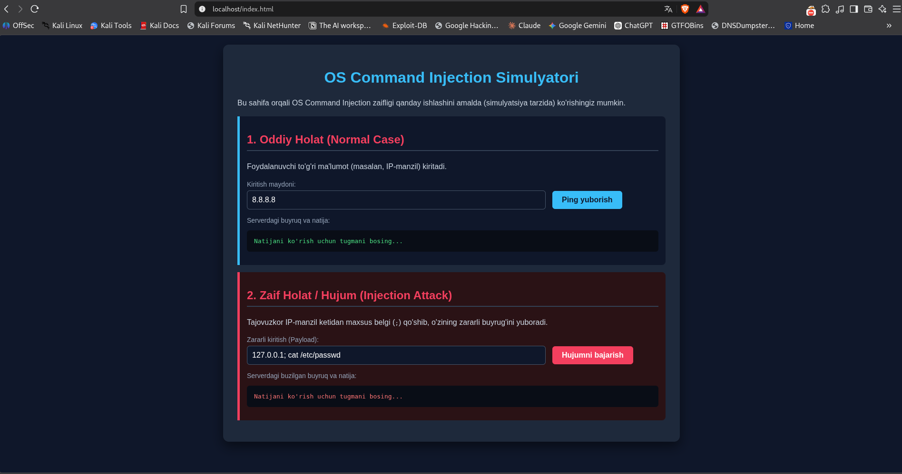

# OS Command Injection

*[Read in English](README.en.md)*

OS Command Injection — bu foydalanuvchi kiritgan narsani tekshirmasdan, validatsiya qilmasdan turib tizimga (serverga) kiritish natijasida yuzaga keladigan zaiflik. Misol uchun, saytda ping yuborish imkoni bo'lsa, orqa fonda foydalanuvchi kiritgan narsaga tekshirmasdan ping yuborib qo'yish.

[](pictures/01-diagram.png)

## Hujumchi uchun: buyruqlarni ajratuvchi belgilar

Linuxda quyidagi 4 ta belgi orqali hujumchi 1 ta buyruqni 2-chisiga ulashi mumkin:

| Belgi | Vazifasi |
|---|---|
| `&&` | Faqat birinchi buyruq muvaffaqiyatli bajarilsa, ikkinchisini ishga tushiradi |
| `\|\|` | Faqat birinchi buyruq xato bersa, ikkinchisini ishga tushiradi |
| `\|` | Birinchi buyruq natijasini ikkinchi buyruqqa uzatadi |
| `;` | Birinchi buyruqning natijasidan qat'iy nazar, ikkinchisini ham bajaradi |

## Dasturchi qiladigan xatoliklar

**1. Foydalanuvchi kiritgan ma'lumotlarni tekshirmaslik (Lack of Input Validation)**
Dasturchi foydalanuvchi kiritgan qiymat (masalan, IP-manzil, fayl nomi yoki foydalanuvchi nomi) haqiqatan ham o'zi kutgan formatda ekanligini (faqat raqamlar yoki harflar) tekshirmasdan to'g'ridan-to'g'ri tizimga uzatadi. Oqibatda, tajovuzkor matn orasiga `;`, `&&` yoki `|` kabi maxsus buyruq belgilarini qo'shib yuborishi mumkin.

**2. To'g'ridan-to'g'ri shell buyruqlarini bajarish funksiyalaridan foydalanish**
Dasturlash tilining operatsion tizim muhitida bevosita buyruq ishlatuvchi xavfli funksiyalaridan (PHP'da `shell_exec()`, `exec()`, `system()`, `passthru()`; Python'da `os.system()`, `subprocess.call(..., shell=True)`) asossiz foydalanish. Bu funksiyalar buyruqni to'g'ridan-to'g'ri operatsion tizim terminaliga uzatgani uchun har qanday qo'shimcha buyruq ham bajarilib ketadi.

**3. Noto'g'ri yoki yetarli bo'lmagan filtrlash (Blacklisting)**
Dasturchi xavfsizlikni ta'minlash uchun faqat ayrim xavfli belgilarni (masalan, `;` yoki `rm` so'zini) qora ro'yxatga kiritib, ularni olib tashlashga urinadi. Qora ro'yxat usuli har doim ham samara bermaydi, chunki tajovuzkor boshqa muqobil belgilar, kodlash usullari (URL encoding yoki Hex) yoki bo'sh joylar orqali bu filtrni chetlab o'tishi mumkin.

## Hujumchi sifatida OS Command Injection'ni tekshirish

### 1. Kirish nuqtalarini (Attack Surface) aniqlash

Veb-ilovada foydalanuvchi kiritgan ma'lumotlar operatsion tizimga uzatilishi mumkin bo'lgan joylarni toping:
- **Tarmoq utilitalari:** Ping, traceroute, nslookup, whois, speedtest kabi funksiyalar
- **Fayl yuklash/boshqarish:** Fayllarni arxivdan chiqarish (unzip), rasmlarni o'lchamini o'zgartirish (ImageMagick orqali), fayl nusxalash amallari
- **Tizim monitoringi/loglar:** Server holatini ko'rsatuvchi sahifalar (`top`, `ps`, `df` kabi buyruqlarni ishlatishi mumkin bo'lgan joylar)

### 2. Qo'lda tekshirish (Manual Testing)

Topilgan maydon orqali tizimga maxsus belgilar va test buyruqlarini yuborib ko'ring:

```
8.8.8.8; id
8.8.8.8 && whoami
8.8.8.8 | uname -a
```

### 3. Vaqtga asoslangan tekshiruv (Time-based / Blind)

Agar sahifa natijani ekranga chiqarmasa (Blind Command Injection), serverning javob berish vaqtini cho'zish orqali tekshiring:

```
127.0.0.1; sleep 10
```

Agar sahifa 10 soniya kechikib ochilsa, demak buyruq bajarilgan va zaiflik mavjud — hatto natija ko'rinmasa ham.

## Tushunish uchun amaliy misol

Konsepsiyani aniqroq tushunish uchun oddiy va zaif holatni yonma-yon ko'rsatadigan kichik lokal HTML sahifa qurdim:

[](pictures/02-simulator-demo.png)

Bu statik, faqat lokal demo (haqiqiy backend buyruq bajarmaydi) — faqat sanitizatsiya qilinmagan ma'lumot shell buyrug'iga yetib borishi *nega* xavfli ekanini vizual ko'rsatish uchun foydali.
