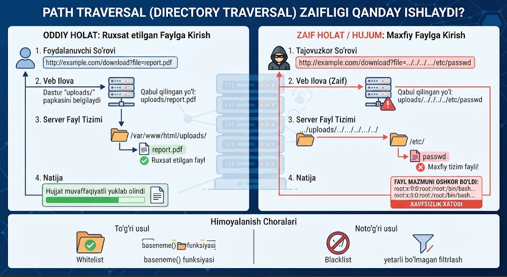

# Path Traversal

Path Traversal — bu veb zaiflik bo'lib, foydalanuvchi kiritgan ma'lumotni tizimga **tekshirmasdan va kodlamasdan** fayl yo'liga qo'shish natijasida kelib chiqadi.

Oddiy foydalanuvchi tizimga kirganda asosan `/var/www/html/index.html` kabi fayl ichida bo'ladi va shu yerdan ichkariga kirib ketaveradi. Lekin hujumchi sifatida, fayl nomi oldiga Linux'da `../` yoki Windows'da `..\` qo'yish orqali belgilangan papkadan chiqib ketish va serverdagi — ruxsat yetarli bo'lsa — istalgan faylni (masalan `/etc/passwd`) ochib ko'rish mumkin bo'ladi.

[](file:///home/abdunnosir/github/ombor/tools-notes/vulnerabilities/path-traversal/pictures/01-diagram.png)

## Dasturchi yo'l qo'yadigan xatoliklar

**1. Foydalanuvchi kiritgan ma'lumotni to'g'ridan-to'g'ri fayl yo'liga qo'shish (Direct Concatenation)** Dasturchi foydalanuvchi yuborgan fayl nomini dasturdagi maxsus papka yo'liga to'g'ridan-to'g'ri qo'shib yuboradi, masalan:

```
include("pages/" . $_GET['page']);
```

Bu foydalanuvchiga matn orasiga `../` belgilarini yuborib, belgilangan papkadan chiqib ketish va serverdagi istalgan faylga murojaat qilish imkonini beradi.

**2. Zaif yoki noto'g'ri filtrlash (Blacklisting)** Dasturchi xavfsizlikni ta'minlash uchun foydalanuvchi kiritgan matn ichidan faqat `../` belgilarini qidirib, ularni olib tashlaydi. Bu osonlikcha chetlab o'tiladi: masalan `....//` yuborilsa, filtr faqat o'rtadagi `../` ni o'chiradi, natijada qolgan qismi yana `../` hosil qiladi. Shuningdek, URL encoding (`%2e%2e%2f`) orqali ham bunday filtrlar aldanadi.

**3. Mutlaq yo'llarni (Absolute Paths) tekshirmaslik** Dastur faqat nisbiy yo'llar (`../`) bilan cheklanib qoladi deb o'ylaydi va foydalanuvchi to'g'ridan-to'g'ri mutlaq yo'lni (`/etc/passwd` yoki `C:\Windows\win.ini`) kiritib yuborganda uni tekshirmaydi. Natijada tizim fayllari to'g'ridan-to'g'ri ochilib qoladi.

**4. Fayl kengaytmalarini noto'g'ri tekshirish** Dasturchi fayl nomi oxirida faqat ma'lum bir kengaytma borligini tekshiradi (masalan, `.pdf` bilan tugashi kerak). Bu usul ko'p hollarda fayl yo'lida `../` ishlatilishiga to'sqinlik qilmaydi, va ba'zida Null Byte injection (`%00`) kabi usullar bilan ham chetlab o'tiladi.

## To'g'irlash

- **Oq ro'yxat (Whitelist) ishlatish:** Foydalanuvchiga erkin fayl nomi kiritishga ruxsat bermang. Buning o'rniga kod ichida faqat ruxsat etilgan fayllarning aniq ro'yxatini (id raqamlari yoki kalit so'zlar orqali) tuzib qo'ying.

- **`basename()` funksiyasidan foydalanish:** Fayl nomidan barcha papka belgilarini (`/` va `\`) avtomatik ravishda kesib tashlaydigan funksiyalardan foydalaning.

- **Haqiqiy yo'lni tekshirish (`realpath()`):** Fayl ochilishidan oldin uning yakuniy yo'li ruxsat etilgan asosiy papka ichida joylashganligini tekshirib ko'ring.

## Haqiqiy ta'siri

Agar ekspluatatsiya qilinsa, hujumchi veb-server kirish huquqiga ega bo'lgan istalgan faylni — konfiguratsiya fayllari, manba kod, credentiallar yoki `/etc/passwd` kabi tizim fayllarini — o'qiy oladi, faqat operatsion tizimdagi foydalanuvchi ruxsatlari yetarli bo'lsa bas.

