# SQL Injection

> 📅 Sana: 2026-10-05
> 🏷️ Mavzu: Web xavfsizlik — zaifliklar seriyasi, 2-kun

## SQL Injection o'zi nima?

Serverga so'rov yuborayotganda unga qo'shimcha ravishda ma'lumotlarni olib kelishni aytish deb qarashimiz ham mumkin.

**Hayotiy misol:** tasavvur qiling, siz og'irlik qilmoqchi emassiz, lekin sizni og'irlik qilganingizni hech kim bilmasligi kerak. Restoranga oddiy mijoz sifatida kirasiz va buyurtma berasiz. Lekin buyurtma berayotganda ofitsiantga (xodimga) "qarab kelishda kassa kalitini ham olib kelishni unutma" deb aytib yuborasiz. Shu narsa server ham biz (ya'ni pentester) o'rtasida sodir bo'lishi **SQL injection zaifligi** deb aytiladi.

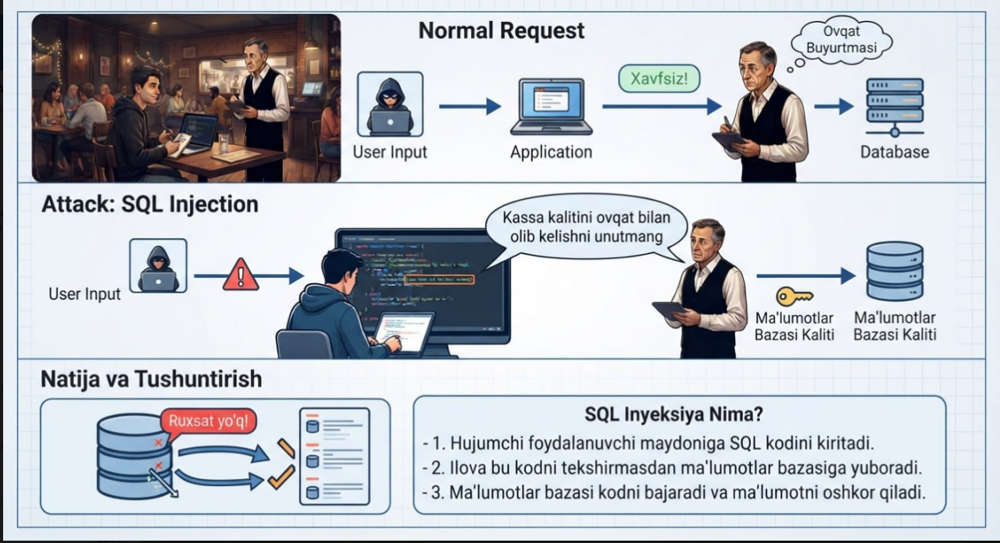

SQL injection zaifligi ko'p yillar davomida OWASP TOP 10 ning 1-o'rinida turgan, lekin oxirgi vaqtlarda pastroqqa tushdi — sababi yangi freymworklar chiqishi natijasida SQL injection zaifligi ko'p yerda yopildi, ammo hali hanuz o'z aktualligini yo'qotmay kelmoqda.

### SQLi orqali hujumchi nima qila oladi?

1. **Begona ma'lumotni ko'rish** — boshqa foydalanuvchilar parollari, shaxsiy/moliyaviy ma'lumotlari.
2. **Ma'lumotni o'zgartirish yoki o'chirish** — narxlarni o'zgartirish, o'ziga huquq berish, butun jadvalni o'chirish (DoS).
3. **Serverni to'liq egallash (RCE)** — ba'zi hollarda bazadan chiqib, server OT'siga buyruq berish (full compromise).

> **ESLATMA:** hujumchi sifatida biz, malumotni foydalanuvchidan kelayotgan ma'lumotni tekshirmasdan turib, to'g'ridan-to'g'ri bazaga yuboradigan yerni topishimiz kerak.

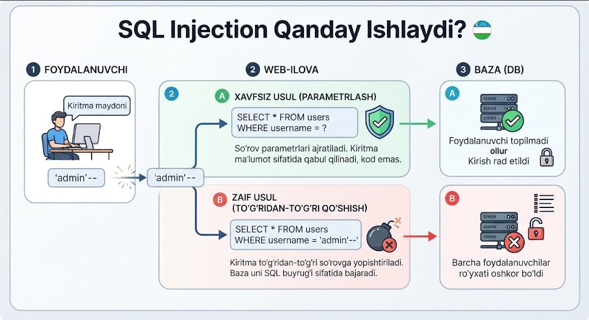

## SQL injectionni aniqlash turlari

### 1. Yakka tirnoq (`'`) qo'yib ko'rish

Agar biz input maydoniga yakka tirnoq qo'ysak va sayt ishlamay xatolik bersa — bilingki, bu yerda SQL injection zaifligi bor.

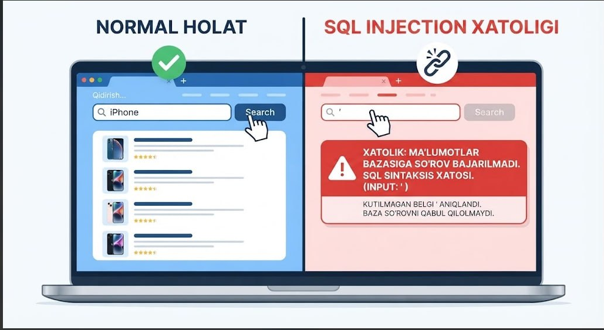

### 2. Mantiqiy (Boolean) shartlar

```
id=10 OR 1=1   →  sahifa odatdagidek ochilsa
id=10 OR 1=2   →  tovar chiqmasa yoki xato bersa
```

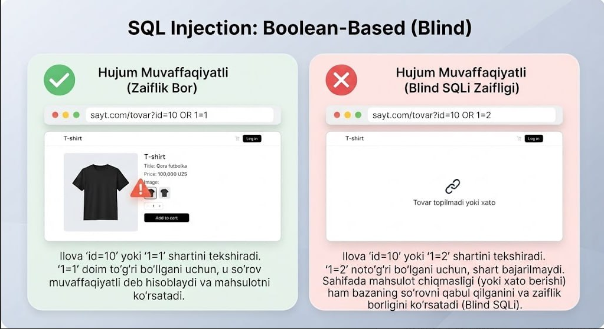

### 3. Matematik amal

Raqamli parametrga `product_id=2-1` yuboring. Agar ilova hali ham 1-tovarni ko'rsatsa — baza orqada hisoblayapti (ochiq eshik).

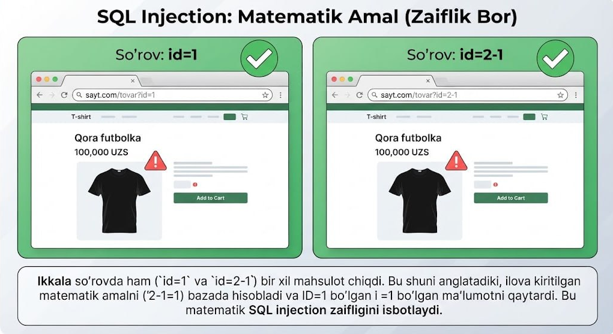

### 4. Vaqt kechikishi (Time-based)

Baza xatoni ko'rsatmasa (Blind), uni "o'ylantiramiz". So'rovdan keyin sayt aynan belgilangan soniya qotib qolsa — buyruq bajarilgan deb bilamiz. ("Blind" degan so'z bu SQL injection turlaridan biri, pastda alohida tushuntirilgan.)

SQL databasasi yaratish uchun ishlatiladigan til bo'lgani uchun har xil xolatlar uchun ishlatilishi mumkin bo'lgan bir nechta turi mavjud — quyidagi MySQL, Oracle degan so'zlar bu baza nomlari:

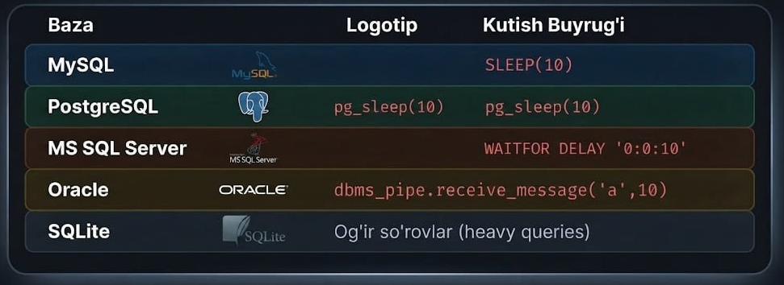

### 5. OAST (Out-of-band)

Bu turda baza sizga javob qaytara olmaydi. Ba'zi hollarda shunaqa bo'ladi, lekin sizga javob qaytara olmayotgani boshqa serverga ham qaytara olmaydi degani emas — shuning uchun biz uni boshqa serverga yuborib ko'ramiz (odatda bu Burp Collaborator bo'ladi).

Shunaqa servislar borki, internetda ular sizga vaqtinchalik sever ishlatib beradi — shunaqa serverlardan foydalanamiz.

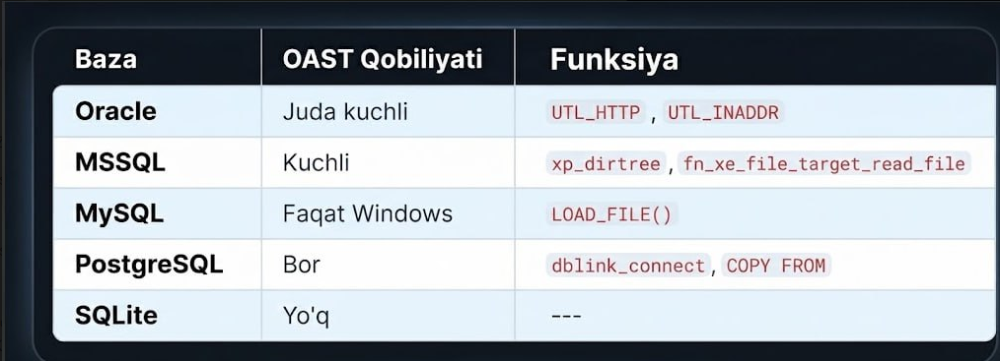

> **MASLAHAT:** birinchi usul `'` ishlamasa, boshqalarini sinab ko'ring, shoshilmang, sabrli bo'ling. Bunda ishlamadi degani zaiflik yo'q degani emas.

## SQL injectionni qayerlardan tekshirishimiz mumkin?

SQL injection faqat login pageda bo'ladi, usha yerda turadi, xolos degani emas — boshqa yerlarda ham bo'lishi mumkin, masalan so'rovlarni Burp suitda ushlab olib, ularga qo'shib yuborishimiz ham mumkin.

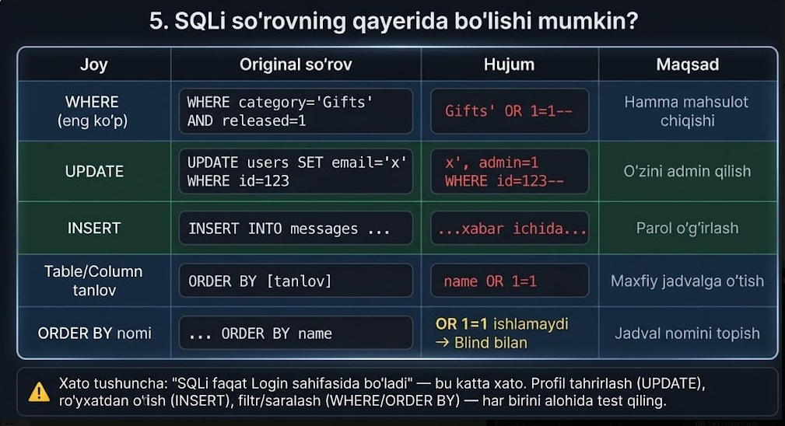

SQL injection bu faqat login'da emas, har bir user kiritishi mumkin bo'lgan yerda bo'lishi mumkin — tekshirib ko'rish kerak.

### Login mantiqini buzish (Login Bypass)

Normal login so'rovi:
```sql
SELECT * FROM users WHERE username = 'ali' AND password = '123'
```
Ikkala shart ham to'g'ri bo'lishini talab qiladi. Login maydoniga `administrator'--` yozamiz:
```sql
SELECT * FROM users WHERE username = 'administrator'--' AND password = '...'
```
`--` parol tekshiruvini izohga aylantiradi. Baza faqat "administrator bormi?" ni tekshiradi, javob "HA" → dastur sizni admin sifatida kiritadi.

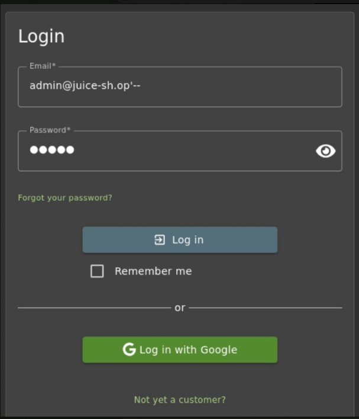

Variantlar: `admin'#` (MySQL), `admin'/*`, `' OR 1=1--` (admin nomini bilmasangiz — birinchi foydalanuvchi, odatda admin).

---

Yuqorida ko'rdikkim, har xil baza turlari uchun alohida-alohida kodlar bor ekan — boshqasining kodini boshqasiga ishlatish orqali biz ulardan hech nimani ola olmaymiz. Shuning uchun bizda bazani qaysi turda va versiyada ekanini oldindan aniqlab olish uchun kodlar bor va bu ish **enumeration** deb ataladi.

## Bazani "rentgen" qilish (Enumeration)

### Baza turi va versiyasi (Fingerprinting)

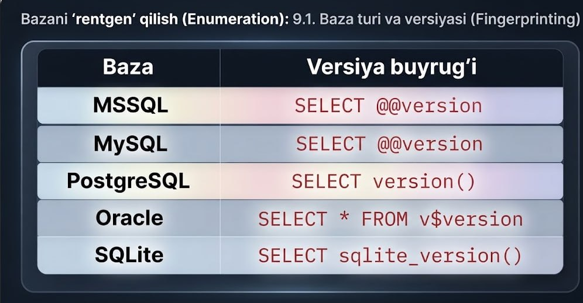

Ma'lumotlar bazasida SQL'da ma'lumotlar ustun-ustun sifatida saqlanadi va biz ularni o'qiyotganimizda ham ustun-ustun qilib olamiz. Shuning uchun biz avval ularni ustun nomlarini va ularni column(ustun)larini, table(jadval)larini nomlarini chiqarib olishimiz kerak — bu uchun biz quyidagilardan foydalanamiz.

### Jadval va ustunlar (Schema)

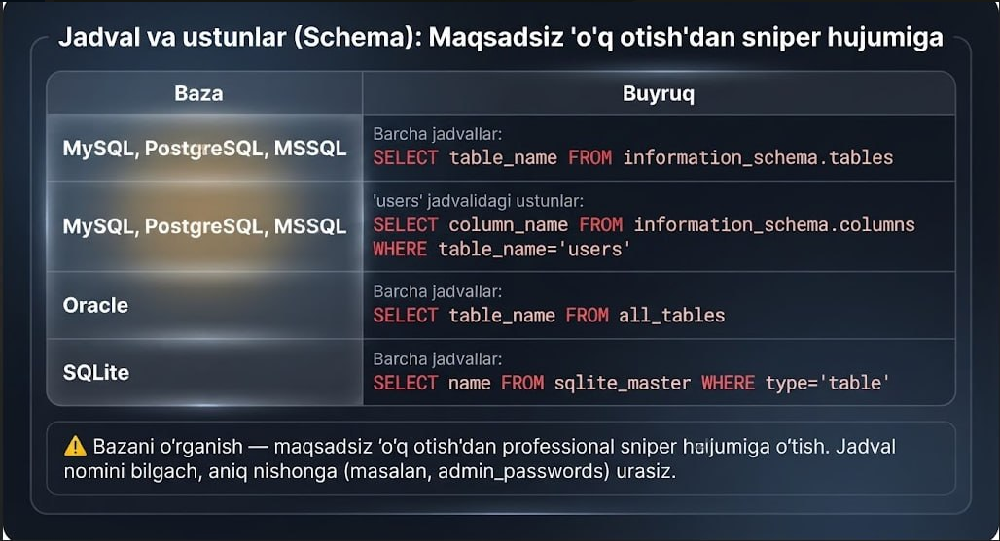

> ⚠️ Bazani o'rganish — maqsadsiz o'q otishdan professional sniper hujumiga o'tish. Jadval nomini bilgach, aniq nishonga (masalan, `admin_passwords`) urasiz.

## SQL Injection turlari (umumiy klassifikatsiya)

### 1. In-Band (Classic) SQL Injection

Bu eng keng tarqalgan va oson tushuniladigan SQL Injection turi. Xakerlar ma'lumotlar bazasiga zararli kod kiritganda, natija to'g'ridan-to'g'ri veb-saytning javobida qaytariladi. Bunga misollar:

- **Error-Based SQL Injection:** Xakerlar ataylab xato keltirib chiqaradigan kod kiritadilar. Ma'lumotlar bazasi xato xabarini qaytaradi, unda bazaning tuzilishi va mazmuni haqida qimmatli ma'lumot bo'lishi mumkin.
- **Union-Based SQL Injection:** Xakerlar `UNION` operatoridan foydalanib, zararli so'rov natijalarini asl so'rov natijalariga qo'shishlari mumkin. Bu ularga bazadagi ma'lumotlarni to'g'ridan-to'g'ri ko'rish imkonini beradi.

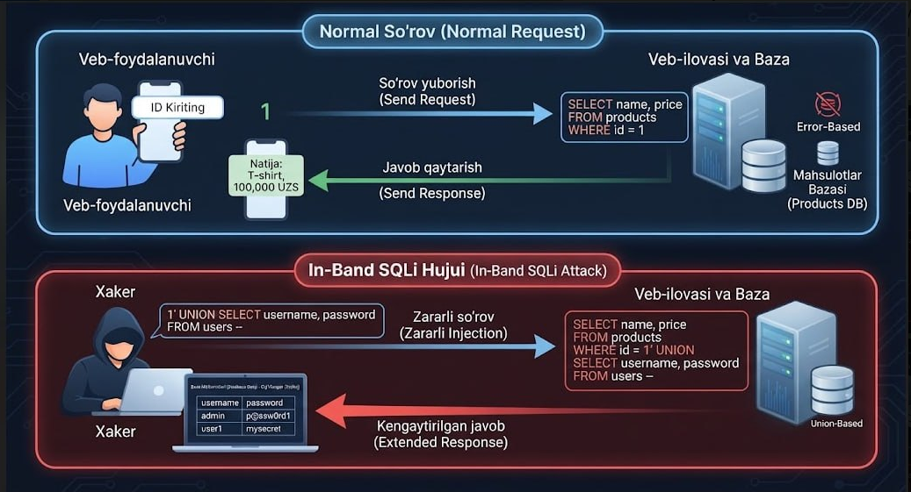

### 2. Inferential (Blind) SQL Injection

Bu turda xakerlar ma'lumotlar bazasiga zararli kod kiritganda, natija veb-saytning javobida to'g'ridan-to'g'ri ko'rsatilmaydi. Buning o'rniga xakerlar veb-saytning javobidagi boshqa o'zgarishlardan (masalan, javob vaqti, sahifaning tarkibi) xulosalar chiqarishga harakat qiladilar. Bunga misollar:

- **Boolean-Based Blind SQL Injection:** Xakerlar ma'lumotlar bazasiga shartli so'rov yuboradilar (masalan, "Ism 'Ali'mi?"). Agar javob "ha" bo'lsa, veb-sayt ma'lum bir tarzda javob beradi (masalan, standart sahifani ko'rsatadi). Agar javob "yo'q" bo'lsa, veb-sayt boshqacha javob beradi (masalan, xato sahifasini ko'rsatadi). Javobdagi farqdan xakerlar shartning to'g'riligini bilib oladilar.

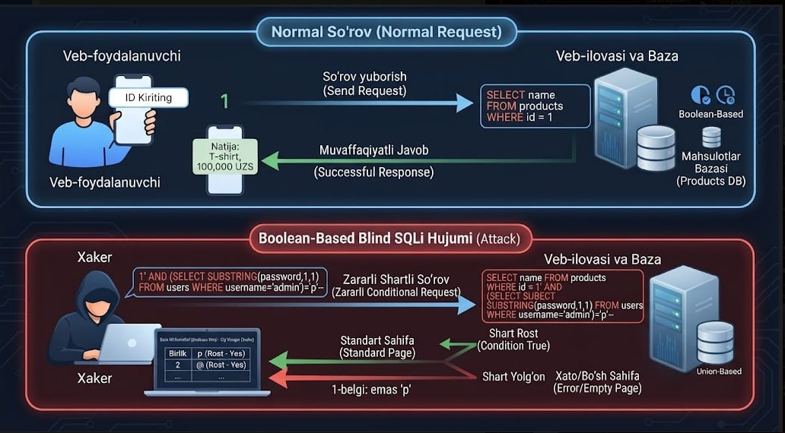

- **Time-Based Blind SQL Injection:** Xakerlar ma'lumotlar bazasiga kod kiritadilar, u ma'lum vaqt davomida hech narsa qilmaydi (masalan, 10 soniya kutadi). Agar so'rov bajarilsa, veb-sayt 10 soniyadan keyin javob beradi. Agar so'rov bajarilmasa, veb-sayt darhol javob beradi. Javob vaqtidan xakerlar so'rovning bajarilganligini bilib oladilar.

### 3. Out-of-Band SQL Injection

Bu eng murakkab SQL Injection turi. Xakerlar ma'lumotlar bazasiga kod kiritganda, natija to'g'ridan-to'g'ri veb-saytga qaytarilmaydi. Buning o'rniga ma'lumotlar bazasi xaker nazoratidagi tashqi serverga ma'lumot yuboradi. Bu odatda ma'lumotlar bazasidagi ma'lumotlarni to'g'ridan-to'g'ri olish qiyin bo'lganda qo'llaniladi.

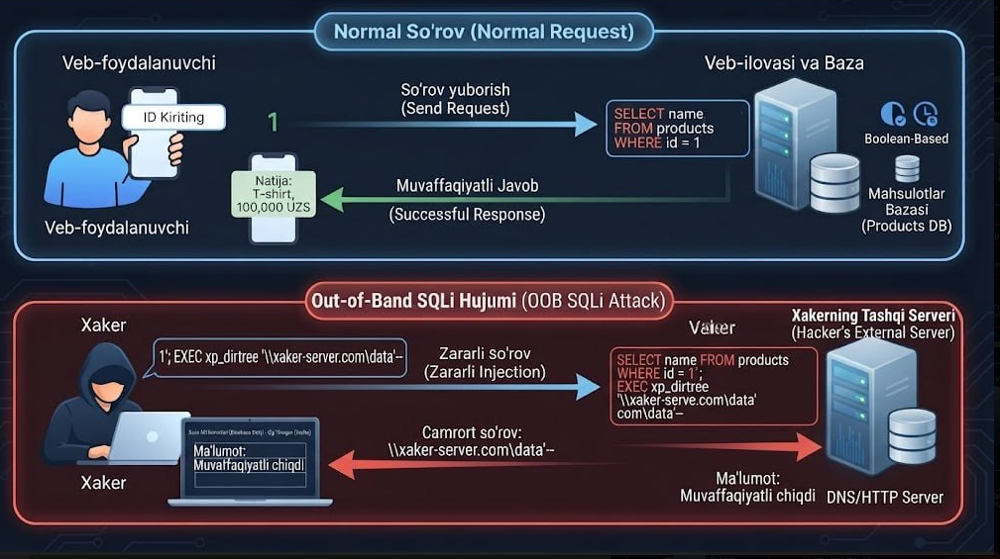

## SQL Injection dan qanday himoyalanish mumkin?

- **Kirishni tekshirish (Input Validation):** Veb-saytingizga kiritilgan barcha ma'lumotlarni tekshiring va ularda zararli belgilar yoki kodlar yo'qligiga ishonch hosil qiling.
- **Parametrlashtirilgan so'rovlar (Parameterized Queries):** SQL so'rovlarini dinamik ravishda yaratish o'rniga, parametrli so'rovlardan foydalaning. Bu xakerlarga so'rovga o'zgartirish kiritish imkonini bermaydi.
- **Xavfsizlikni kuchaytirish (Security Hardening):** Veb-saytingiz va ma'lumotlar bazangizni xavfsizlik nuqtai nazaridan eng so'nggi patch va yangilanishlar bilan yangilab turing.

## Dasturchi yo'lga qo'yadigan xatoliklar

### 1. To'g'ridan-to'g'ri matnni birlashtirish (String Concatenation)

**Xato nima?** Foydalanuvchi kiritgan ma'lumotni (masalan, forma orqali yuborilgan logindan) SQL so'roviga shunchaki qo'shib yuborish.

**Misol (Xavfli kod):** `"SELECT * FROM users WHERE username = '" + userInput + "'"`

**Natija:** Agar foydalanuvchi userInput o'rniga maxsus SQL kod yozsa, so'rovning mantiqi o'zgarib ketadi.

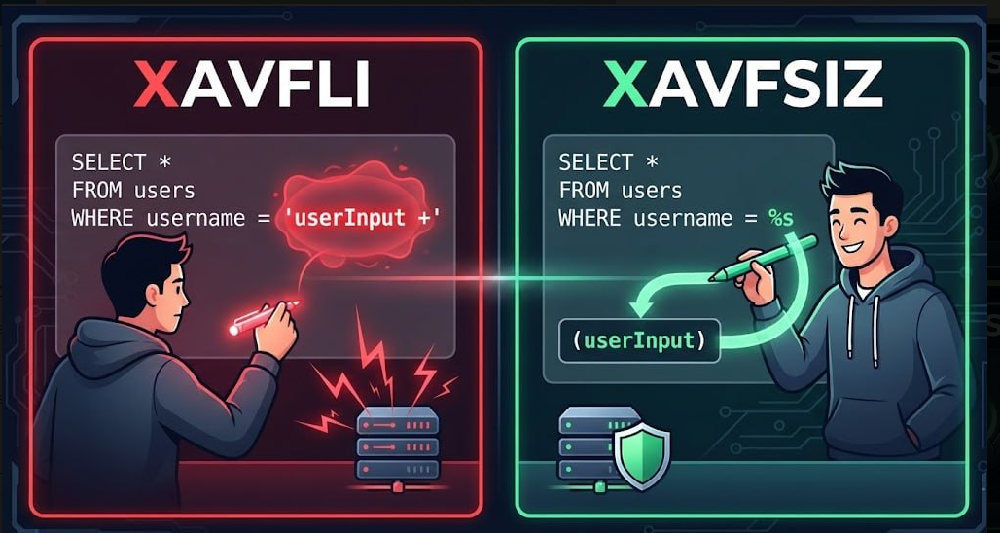

### 2. Parametrlashtirilgan so'rovlardan (Prepared Statements) foydalanmaslik

**Xato nima?** Ma'lumotlar bazasi bilan ishlashda tayyor xavfsiz shablonlardan (parameters, bind variables) foydalanmaslik. Dasturchi har safar so'rovni qo'lda tuzib, o'zgaruvchilarni to'g'ridan-to'g'ri ichiga yozib ketishi shular jumlasidandir.


### 3. Foydalanuvchi kiritgan ma'lumotlarga ko'r-ko'rona ishonish (Lack of Validation)

**Xato nima?** Kiritish maydonlariga kelgan ma'lumotning turi, uzunligi yoki maxsus belgilar (`'`, `--`, `;`) bor-yo'qligini tekshirmaslik (sanitization va validation qilmaslik).

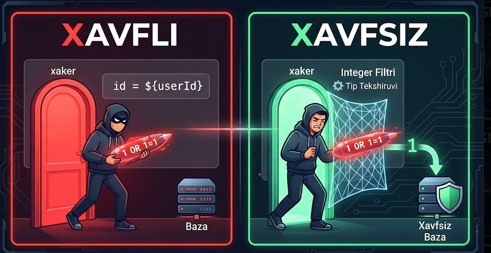

### 4. Xatolik xabarlarini ochiqchasiga ekranga chiqarish (Verbose Error Messages)

**Xato nima?** Ma'lumotlar bazasida xatolik yuz berganda, asl SQL xato xabarini (masalan, `MySQL syntax error...`) to'g'ridan-to'g'ri foydalanuvchi ekraniga chiqarib qo'yish.

**Natija:** Bu xakerga bazaning qaysi turda ekanligi va tuzilishi haqida qimmatli ma'lumot beradi (Error-Based SQLi uchun yo'l ochadi).

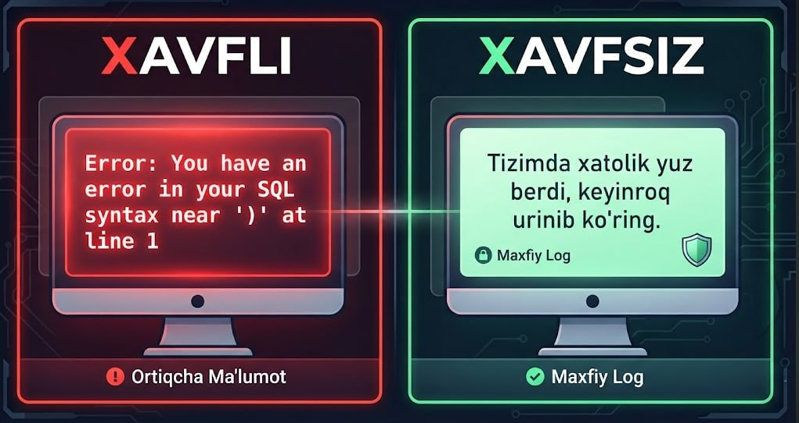

### 5. Dinamik so'rovlarda Oq ro'yxatdan (Whitelisting) foydalanmaslik

**Xato nima?** Ba'zi joylarda (masalan, `ORDER BY` yoki jadval nomlarida) parametrlardan foydalanib bo'lmaydi. Dasturchi foydalanuvchi tanlagan ustun nomini to'g'ridan-to'g'ri so'rovga qo'shib yuboradi. Agar qaysi nomlar kiritilishi qat'iy cheklanmasa (oq ro'yxat tekshirilmasa), xaker istalgan buyruqni tiqishtirishi mumkin.

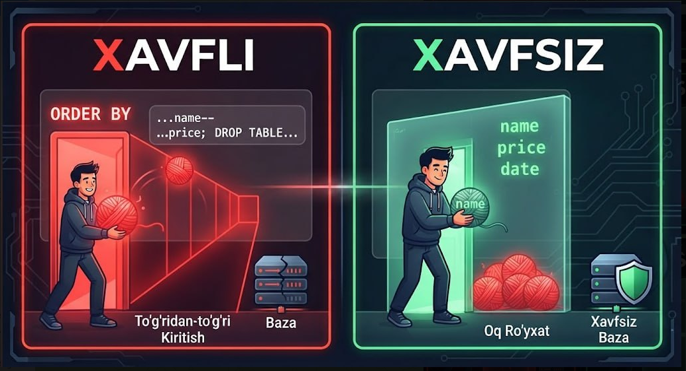

### 6. ORM (Object-Relational Mapping) xavfsizlik mexanizmlarini chetlab o'tish

**Xato nima?** Zamonaviy freymvorklar (Hibernate, Entity Framework, Django ORM va boshqalar) SQLi'dan avtomatik himoya qiladi. Lekin dasturchi qaysidir murakkabroq joyda "xom" so'rov yozish uchun raw query yoki `db.query()` funksiyalaridan noto'g'ri foydalansa, barcha xavfsizlik himoyasi yo'qqa chiqadi.

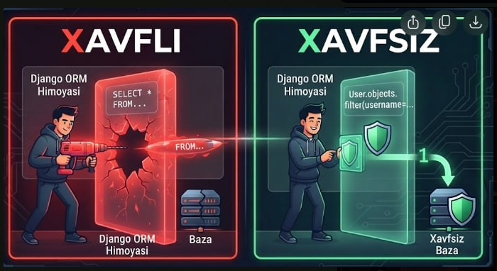

---

## Qisqa xulosa

| Zaiflik sinfi | Qayerda aniqlanadi | Asosiy sabab |
|---|---|---|
| In-Band (Error/Union-based) | Javob to'g'ridan-to'g'ri ekranda | Natijani filtrlamasdan chiqarish |
| Blind (Boolean/Time-based) | Javobda ko'rinmaydi, faqat xulosa chiqariladi | Shart yoki kechikish orqali bilib olinadi |
| Out-of-Band (OAST) | Boshqa serverga (DNS/HTTP) ma'lumot ketadi | To'g'ridan-to'g'ri javob yo'q bo'lgan holatlar uchun |

**Himoya qilishning umumiy tamoyili:** foydalanuvchidan kelgan hech qanday ma'lumotni SQL so'roviga xom holda (string concat) qo'shmaslik — har doim **parameterized query / prepared statements** ishlatish, inputni validatsiya qilish va xato xabarlarini foydalanuvchiga to'liq ko'rsatmaslik.
