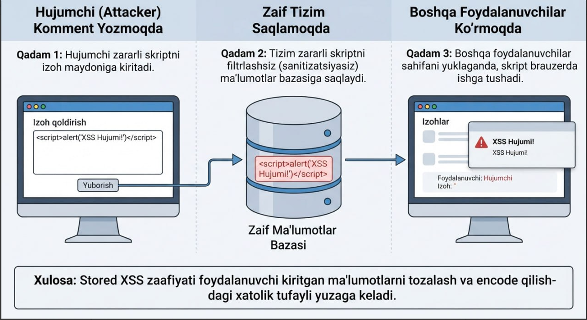
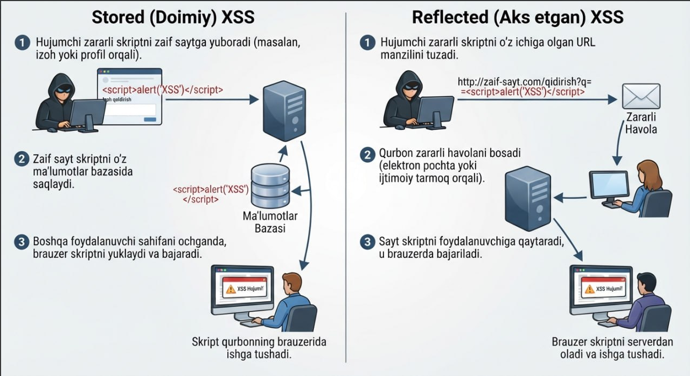
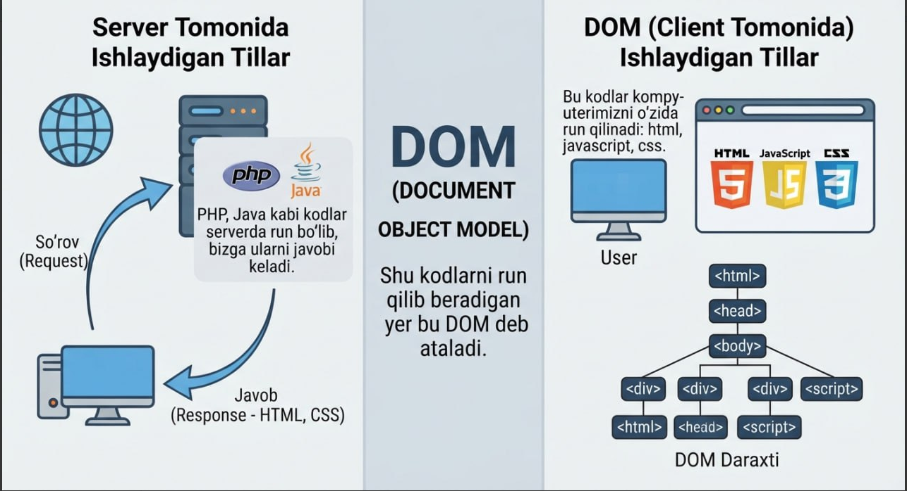
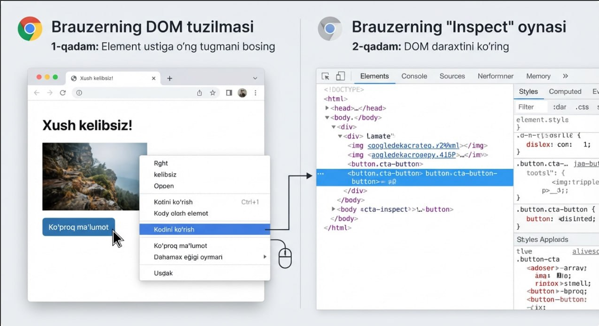
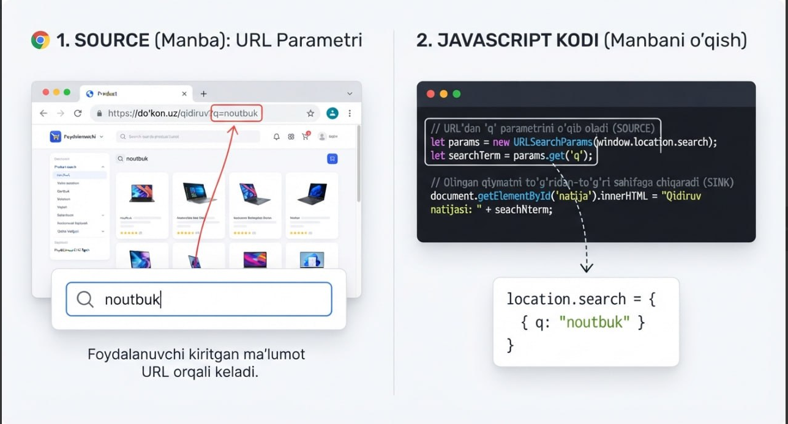
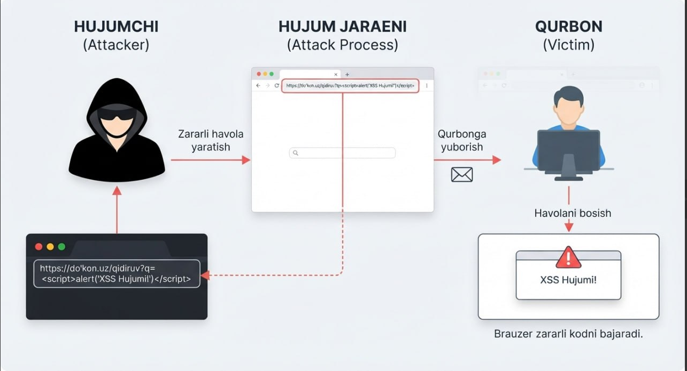
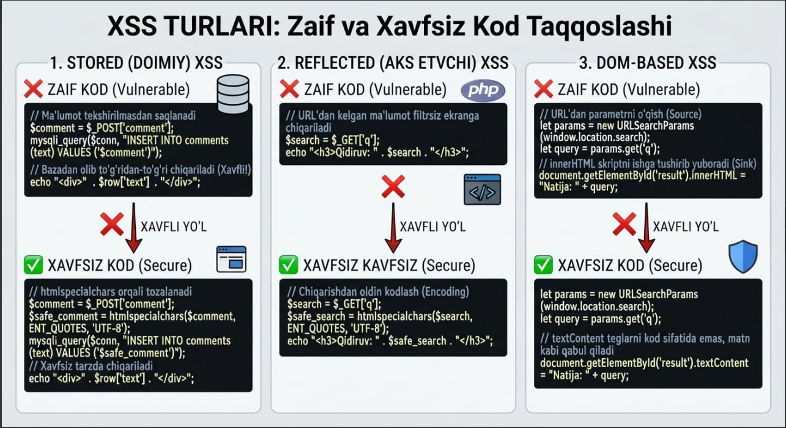

# Cross-Site Scripting (XSS)

> 📅 Sana: 2026-10-04
> 🏷️ Mavzu: Web xavfsizlik — zaifliklar seriyasi, 1-kun

## XSS o'zi nima?

Bu hujumchining dasturchi o'ylagan yoldan yurmasdan qidiruv paneliga yoki shu kabi o'zi yozishi mumkin bo'lgan yerlarga JavaScript kodini yozishi va serverda ishlayotgan JavaScript kodiga aralashuvi.

## XSS turlari

XSS zaifligi bir nechta turga bo'lib o'rgatiladi. Bu turlar ularni amalga oshirilish prinsipi bilan bir-biridan farq qiladi:

1. **Reflected XSS**
2. **Stored XSS**
3. **DOM based XSS**

### Bu 3 tasi bir-biridan nimasi bilan farq qiladi?

**Reflected XSS** — bunda hujumchi o'zi JavaScript kodini kiritadi va serverdan javobni o'zi oladi. Ya'ni hujumchi `<script>alert(salom)</script>` deb yuborsa, Reflected XSS mavjud bo'lgan serverda alert ishlab ketadi va endi u alertni o'rniga o'ziga kerakli ma'lumotlarni olish uchun kod yozadi — masalan, foydalanuvchi cookie'si yoki ularni tokenlari kabi narsalarni olishni aytishi mumkin.

**Stored XSS** — bu turida hujumchi comment yozish yoki shu kabi yerlarga zararli JavaScript kodini yozib qo'yadi va saqlaydi. Masalan, hujumchi `<script>alert("XSS HUJUMI")</script>` deb comment yuklaydi.



**Xulosa:** Stored XSS zaifligi foydalanuvchi kiritgan ma'lumotlarni tozalash va encode qilishdagi xatolik tufayli yuzaga keladi.

**NATIJA:** tizimga kirgan yoki usha saytga kirgan hamma foydalanuvchilarga shunaqa XSS HUJUMI deb yozilgan alert chiqib keladi.

Yuqorida keltirilgan 2 ta turni farqini tushunib olaylik:



## DOM based XSS

Buni tushunishdan oldin avvalambor **DOM** nima ekanini tushunib olishimiz kerak.

**DOM (Document Object Model)** — bazi kodlar, masalan PHP, Java kabi kodlar serverda run bo'lib, bizga ularni javobi keladi. Lekin bizda yana shunday kodlar borki, ular saytni ishlashi uchun kerak va ishlash tezligini oshirish uchun ularni serverda emas, balki kompyuterimizni o'zida run qilinadi. Bular HTML, JavaScript kabi kodlardur. Shu kodlarni run qilib beradigan yer bu **DOM** deb ataladi.



Endi agar kompyuterimizda domni qayerdan ko'raman desangiz — brauzerda sahifa elementiga o'ng tugma bosib, "Kodini ko'rish" orqali DOM daraxtini ko'rishimiz mumkin:



### Source va Sink

DOM based XSS'ni tushunishimizdan oldin biz yana 2 ta atamani tushunib olishimiz kerak: **Source** va **Sink**.

**SOURCE** — bu biz foydalanuvchi sifatida kiritishimiz mumkin bo'lgan yerlar: masalan qidiruv paneli, comment yozish yeri — shu kabi biz kiritishimiz mumkin bo'lgan yerlar.

**SINK** — xuddi shu biz kiritgan kodni JavaScript'da ishlatib beradigan yeri. Misol: `innerHTML`, `outerHTML` kabi teglar.



### DOM based XSS'ni oddiy hayotiy misol bilan tushunaylik: Do'kon va Qidiruv Paneli

Tasavvur qiling, internet-do'konda oddiy qidiruv paneli bor. Siz u yerga nimadir yozib qidirsangiz, sayt sahifasida quyidagicha yozuv chiqadi:

> *Siz qidirdingiz: [ Foydalanuvchi yozgan so'z ]*

Bu matnni ekranga chiqarish uchun saytning **JavaScript** kodi ishlaydi.

**1. Jarayon qanday ketadi?**

- **Manba (Source):** Brauzerdagi JavaScript kodi URL manzilidan yoki qidiruv satridan siz yozgan narsani o'qib oladi (masalan, `location.search` orqali).
- **Xavfli joy (Sink):** Saytning dasturchisi bu olingan ma'lumotni hech qanday tekshiruvdan o'tkazmasdan (sanitizatsiya qilmasdan), to'g'ridan-to'g'ri sahifaning HTML tuzilmasiga qo'shib qo'yadigan xavfli funksiyaga (`innerHTML` kabilarga) berib yuboradi.

**2. Hujum qanday amalga oshiriladi?**

Hujumchi sizga oddiy matn emas, balki maxsus skript yozilgan havolani yuboradi:

```
https://do'kon.uz/qidiruv?q=<script>alert('XSS Hujumi!')</script>
```

Siz shu havolani bosganingizda, server bu hujumdan umuman xabari yo'q (chunki serverga hech qanday zararli so'rov bormaydi). Lekin brauzeringiz ishga tushib, sahifadagi JavaScript kodi URL'dagi o'sha `<script>` tegi bilan kelgan matnni o'qiydi.

Sayt uni oddiy matn deb o'ylab, ekranga kod sifatida chiqaradi (`innerHTML` orqali) va natijada brauzer uni bajarib yuboradi — ekranda sotdan **"XSS Hujumi!"** degan oyna chiqib keladi.



## Dasturchi qanday xatoliklarga yo'l qo'yadi?

*(umumiy XSS zaifligini paydo bo'lishi uchun)*

### 1. Stored (Doimiy) XSS uchun dasturchi xatosi

**Asosiy xato:** Dasturchi foydalanuvchidan kelgan ma'lumotni (masalan, izohlar, profil ma'lumotlari, chat xabarlari) ma'lumotlar bazasiga saqlashdan oldin ham, bazadan olib boshqa foydalanuvchilarga ko'rsatishdan oldin ham **tekshirmasa, tozalamasa (sanitizatsiya qilmasa) va maxsus belgixonalarga (HTML encoding) o'tkazmasa**.

**Qanday yuzaga keladi:**
Dasturchi foydalanuvchi faqat oddiy matn (Salom!) yozadi deb o'ylaydi. Lekin hujumchi `<script>alert(1)</script>` kabi kod yuborsa, dasturchining kodi buni bazaga shundoq saqlab qo'yadi. Keyinchalik boshqa foydalanuvchi o'sha sahifani ochganda, server bazadagi zararli skriptni sahifaga qo'shib yuboradi va u qurbonning brauzerida ishga tushadi.

### 2. Reflected (Aks etgan) XSS uchun dasturchi xatosi

**Asosiy xato:** Dasturchi foydalanuvchi brauzeridan kelgan so'rovdagi ma'lumotni (URL parametrlari, forma ma'lumotlari — GET yoki POST so'rovlar) hech qanday tekshiruvsiz **darhol foydalanuvchining o'ziga qaytarib (ekranga chiqarib) bersa**.

**Qanday yuzaga keladi:**
Masalan, qidiruv natijalari sahifasida: *"Siz qidirdingiz: [foydalanuvchi yozgan so'z]"*. Dasturchi foydalanuvchi kiritgan ma'lumot bazaga saqlanmaydi-ku, demak xavfsiz deb o'ylaydi. Agar dasturchi o'sha kiritilgan so'zni ekranga chiqarishdan oldin maxsus belgilarga o'tkazmasa (HTML encode qilmasa), hujumchi tayyorlagan zararli havola orqali kelgan skript foydalanuvchining ekranida darhol aks etadi va bajariladi.

### 3. DOM-based XSS uchun dasturchi xatosi

**Asosiy xato:** Dasturchi mijoz tomonida ishlaydigan JavaScript kodida xavfli **Source** (manba: masalan, `location.search` yoki `location.hash`) orqali olingan ma'lumotni hech qanday filtrsiz to'g'ridan-to'g'ri xavfli **Sink** (qabul qiluvchi: masalan, `innerHTML` yoki `document.write`) funksiyalariga uzatib yuborsa.

**Qanday yuzaga keladi:**
Dasturchi URL parametridagi ma'lumotni olib, uni dinamik ravishda sahifaga chiqarish uchun `element.innerHTML = ...` kodidan foydalanadi. `innerHTML` xususiyati matnni oddiy yozuv emas, balki HTML tegi sifatida qabul qilgani uchun, URL orqali kelgan `<script>` tegi brauzer tomonidan kod sifatida bajarib yuboriladi. Bu yerda server umuman aybdor bo'lmasligi mumkin — hammasi client (brauzer) tomonida yozilgan ehtiyotsiz JavaScript kodidadir.

Kod shunaqa xavfsiz holatda yozilishi kerak:



---

## Qisqa xulosa

| Tur | Zararli kod qayerdan keladi | Zararli kod qayerda saqlanadi | Kim ayblidir |
|---|---|---|---|
| Reflected | URL / so'rov parametri | Saqlanmaydi, darhol qaytadi | Server — encode qilmagani uchun |
| Stored | Comment / profil / chat kabi joy | Ma'lumotlar bazasida | Server — sanitizatsiya qilmagani uchun |
| DOM-based | URL (`location.search`/`hash`) | Umuman serverga bormaydi | Client JS — `innerHTML`/`document.write` ishlatgani uchun |

**Himoya qilishning umumiy tamoyili:** foydalanuvchidan kelgan har qanday ma'lumotni HTML sifatida emas, matn sifatida chiqarish (`textContent`, `htmlspecialchars`, encoding) — hech qachon xom holda `innerHTML`/`echo`'ga bermaslik.
